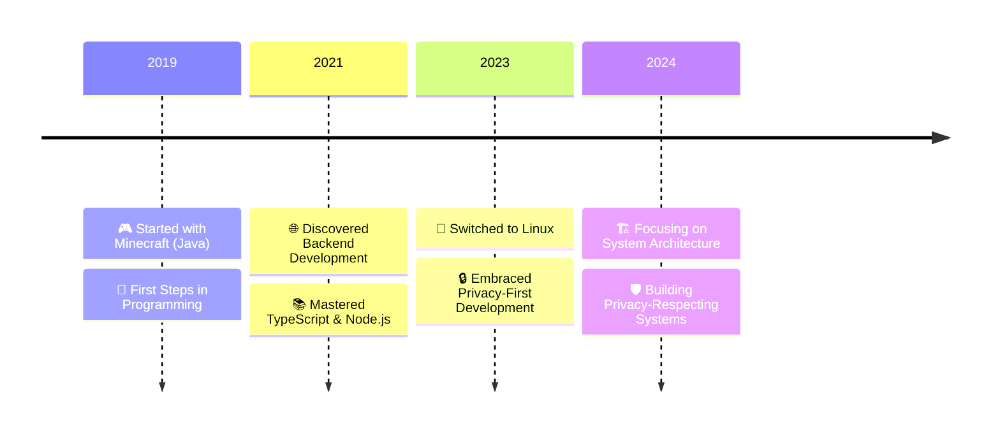
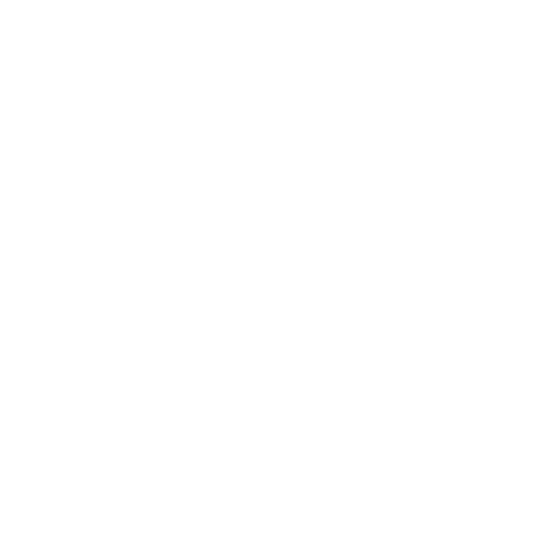

# 👋 Hi, I'm Maximilian

<div align="center">

### Privacy-First Backend Developer | Open Source Enthusiast
*"Your life online is a goldmine for sale - big tech knows everything about you, and you're giving it away for free."*

[](https://wakatime.com/badge/user/0ad8b047-7281-4bfc-9153-e679a73273f3/project/66e3e74d-0baf-4313-b02a-e37be2c693a8)

</div>

## 🚀 About Me
I'm a 15-year-old backend developer passionate about creating privacy-respecting systems. My journey in tech started at age 10 with Minecraft plugins, evolving into full backend development by 12. Today, I specialize in building secure, scalable backend solutions that put user privacy first.

```plaintext
📍 Location:     North Rhine-Westphalia, Germany
🗣️ Languages:    German (Native), English (Fluent)
⏰ Availability: Part-time (Student)
💼 Experience:   5 Years Active Development
🎯 Focus:        Backend Development, System Architecture
```

> 💡 **Fun Fact**: I use Arch Linux btw! Made the switch as part of my journey towards digital privacy and control.

## 💻 Technical Expertise

### Core Stack
<div align="left">
  <details open>
    <summary><b>🔧 Languages</b></summary>
    <br>
    
  </details>

  <details open>
    <summary><b>⚡ Runtimes</b></summary>
    <br>
    
  </details>

  <details open>
    <summary><b>🏗️ Frameworks</b></summary>
    <br>
    
  </details>

  <details open>
    <summary><b>💾 Databases</b></summary>
    <br>
    
  </details>

  <details open>
    <summary><b>🛠️ Tools & Technologies</b></summary>
    <br>
    
  </details>
</div>

### Development Environment
```plaintext
📝 Editor:     VSCodium with Vim keybindings
🐧 OS:         Arch Linux
🔧 Tools:      Git, Docker, F(L)OSS alternatives
📚 Principles: Clean Code, SOLID, DRY
```

### Development Standards
- 🏗️ **Architecture**: Clean Architecture, Domain-Driven Design
- 🔒 **Security**: Zero Trust, Privacy by Design
- 📊 **Quality**: Comprehensive Testing, CI/CD
- 🚀 **Performance**: Scalable from Day One

## 📊 GitHub Activity
<div align="center">
  
  
</div>

## 🌟 What I Bring to the Table
### For Teams & Companies
- 🏗️ Scalable backend architectures
- 🔒 Security-first development practices
- 🚀 Modern tech stack expertise
- 📈 Performance-oriented solutions

### For Open Source
- 🌟 Clean, documented code
- 🤝 Active collaboration
- 🔒 Privacy-focused features
- 📚 Knowledge sharing

## 📈 Journey & Process



### Development Workflow
1. 📋 Requirements & Privacy Analysis
2. 🎯 Architecture Design
3. 🔄 Agile Development
4. 🧪 Comprehensive Testing
5. 📚 Documentation & Knowledge Sharing

## 🔮 Current Focus
- 🏗️ Mastering System Architecture
- 📚 Advanced Backend Patterns
- 🌟 Open Source Contributions
- 🚀 Privacy-First Solutions

## 🌐 Let's Connect

<div align="left">
  <a href="https://discord.com/users/504014438383222804">
    
  </a>
  <a href="https://guthmann.dev">
    
  </a>
  <a href="mailto:maximilian@guthmann.dev">
    
  </a>
</div>

Let's collaborate on creating secure, efficient, and privacy-respecting solutions! Whether you're:
- 🏢 A company seeking backend expertise
- 🌟 An open source project looking for contributors
- 👥 A fellow developer interested in privacy-first solutions

---

<div align="center">

*"Privacy is not about something to hide, but something to protect."*

</div>